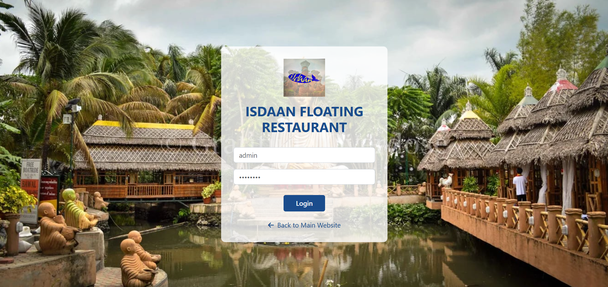

# 🐟 Isdaan Floating Restaurant Web System

A responsive, front-end web reservation system for Isdaan Floating Restaurant. It allows customers to book online reservations and enables admins to manage reservations efficiently with email verification and a dashboard interface.




## Features Added / Enhanced

- 📝 Online Reservation Form with Input Validation  
- 📧 Email Verification using EmailJS  
- 📬 Email Notification Confirmation for Users  
- 🔐 Admin Login Authentication  
- 🛠️ Admin Dashboard for Reservation Management  
- 📅 View My Reservations Page  
- 🎨 Responsive and Mobile-Friendly UI Design  
- 📍 Cottages Viewing Option  

> ⚠️ Note: The original system had no web front-end interface. A complete custom UI was designed and developed from scratch for this version.

## 💻 Technologies Used

- HTML5 / CSS3 / JavaScript (Vanilla)
- EmailJS for email handling
- Responsive design (mobile-friendly)

## 🛠️ Installation Instructions

1. Clone the repository:

   ```bash
   git clone https://github.com/yourusername/isdaan-reservation-system.git
   ```

2. Navigate to the folder:

   ```bash
   cd isdaan-reservation-system
   ```

3. Run `index.html` in Live Server to run.


## ▶️ How to Use

1. Open the `index.html` file in your browser.
2. Register an account by filling in your details.
3. Fill out the reservation form.
4. Receive an email confirmation for your booking.
5. Admin can log in via `admin-login.html` to manage reservations.

   
## 🎥 Demo Video

📽️ [Watch the Demo Video Here]([https://drive.google.com/your-demo-link](https://drive.google.com/file/d/10twlTkk8YF5J2Ljowsb5NIPOzj-bO5iN/view))

## 📁 Folder Structure

```
ISDAAN-FOLDER/
│
├── src/ # Source code files
│ ├── css/
│ │ ├── admin-style.css
│ │ ├── new-style.css
│ │ └── style.css
│ │
│ ├── images/ # UI screenshots and assets
│ ├── img/ # Icons and logos
│ │
│ ├── js/
│ │ ├── admin-auth.js
│ │ ├── admin-dashboard.js
│ │ ├── auth.js
│ │ ├── email-service.js
│ │ ├── main.js
│ │ ├── my-reservations.js
│ │ └── reservation.js
│ │
│ ├── admin-dashboard.html
│ ├── admin-login.html
│ ├── index.html
│ ├── my-reservations.html
│ ├── reservation.html
│ └── verify-email.html
│
├── docs/ # Supporting documents
│ ├── SRS.pdf # Software Requirements Specification
│ └── TechnicalDocumentation.pdf
│
└── README.md # Project readme
```

## 👥 Contributors
- **Hallig, Siera Q.**
- **Macasaet, Kate Ashley** 
- **Plata, Giannah Faith** 
- **Torres, Tracy San Jose** 

## 📄 Supporting Documents

All supporting documents can be found inside the `/docs` folder:

- [Software Requirements Specification (PDF)](docs/SRS.pdf)
- [Technical Documentation (PDF)](docs/Technical_Documentation.pdf)
- [Presentation Slides (PPT or PDF)](docs/Presentation.pdf)

---

## 📚 Original System Credit

This web system is based on the original Capstone Project:

**Web-Based Reservation and Scheduling System in Isdaan Floating Restaurant**  
*Calauan, Laguna*  

**By:**  
- SAMANIEGO, ROEL A.  
- VERIDIANO, MARJONNIEL S.  
- MACATANGAY, ARDY L.


© 2025 Laguna State Polytechnic University – Isdaan Reservation System  

